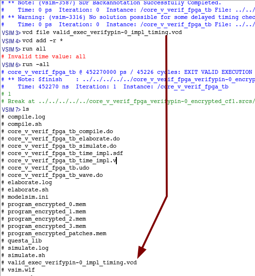
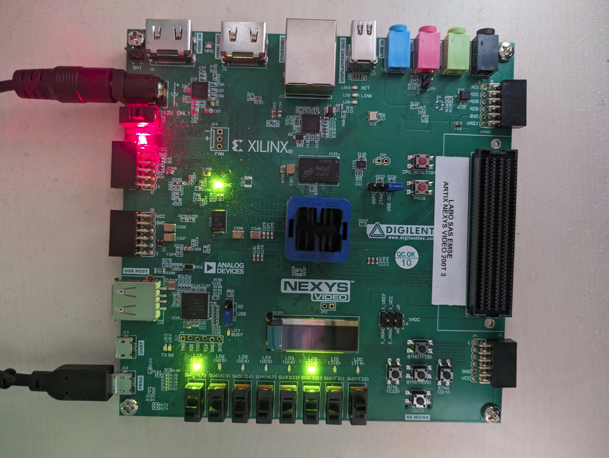
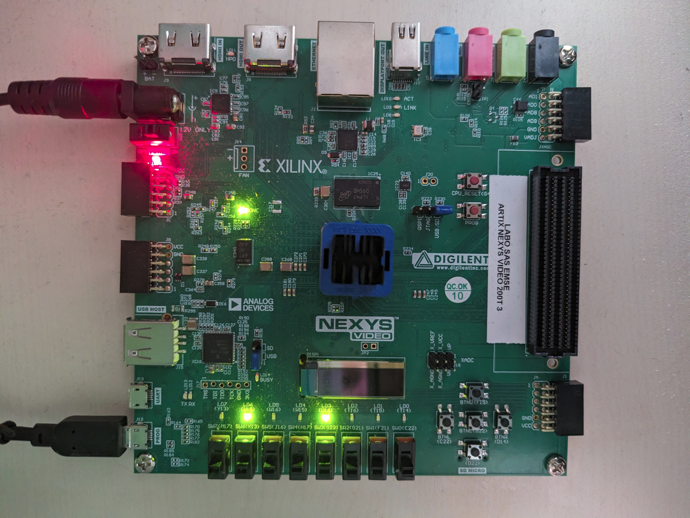
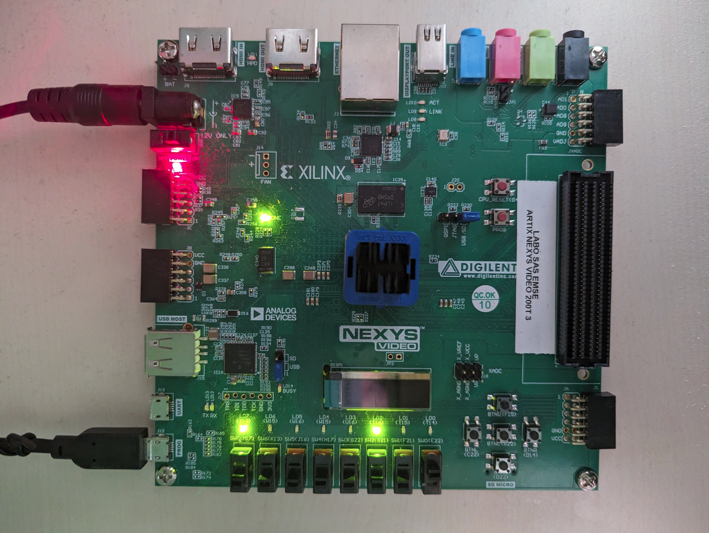
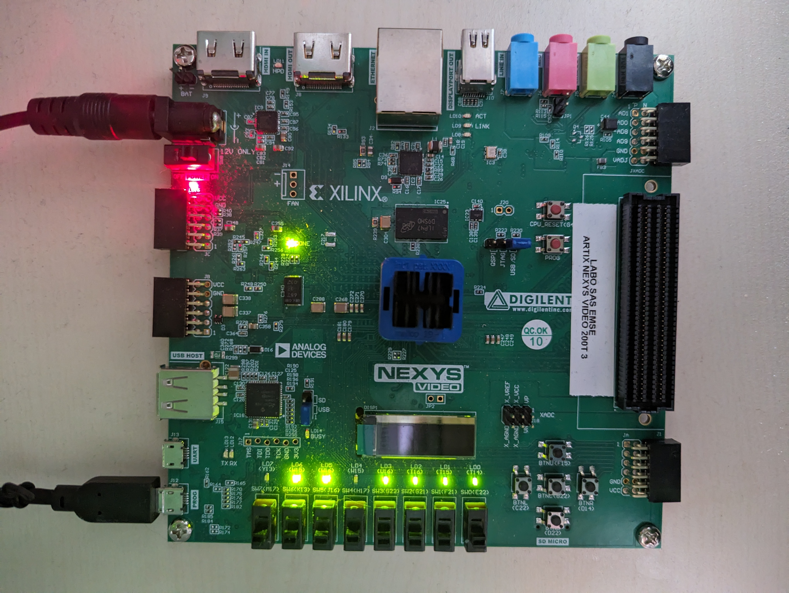

## Getting Started

### Prerequisites
#### RISC-V Toolchain
1. Download a RISC-V toolchain. The one used in the paper is available: TODO link with access to the toolchain

2. It is recommended to extract the toolchain in `/opt/corev`. However, if you intend to extract in another location the toolchain, you can create a symbolic link. If you install corev somewhere else, you should edit the `RISCV` variable in `Makefile` or add `RISCV=<path/to/corev>` everytime you execute the `make` command. 
``` bash
ln -s <path/to/corev> /opt/corev
```

#### Verilator: simulator
3. Install Verilator by following the [Git Quick Install](https://veripool.org/guide/latest/install.html#git-quick-install). **Be carefull to select the tag v4.220** by running `git checkout v2.220` before running `autoconf`.

#### GTKwave: wave viewer
4. Verilator simulation can generated waveform (.vcd format). It is recommended to use GTKwave to view waveform.
``` bash
sudo apt install gtkwave
```


The `Makefile` launchs compilation of programs, compilation, elaboration, FPGA synthesis, FPGA implementation of RTL  and simulation.
You can generate `explicit_target_names.mk` by executing `./configure.py`, which contains every valid target name of `Makefile` (usefull to use `<tab>`).
In that case tape `make -f explicit_target_names.mk <tab>`.

### Behavioral simulation only: Verilator
#### Instruction integrity (without Control signal integrity)
1. Simulate execution of `fibonacci`, without encryption and save PC/instr in Fetch at every cycle.
``` bash
make OBJ/PROGRAMS/fibonacci/SIM/LOG/program_save_ref.log
```

2. Simulate execution of `fibonacci`, without encryption, **compare PC/instr in Fetch at every cycle with previously saved reference**, generate reference if not exist.
``` bash
make OBJ/PROGRAMS/fibonacci/SIM/LOG/program_verif.log
```

3. Simulate execution of `fibonacci`, without encryption, **compare PC/instr in Fetch at every cycle with previously saved reference** and generate waveform.
``` bash
make OBJ/PROGRAMS/fibonacci/SIM/VCD/program.vcd
gtkwave OBJ/PROGRAMS/fibonacci/SIM/VCD/program.vcd SRC/CONFIGS/core_v_fpga_signals_debug.gtkw &
```
  
4. Simulate execution of `fibonacci`, **with encryption**, compare PC/instr in Fetch at every cycle with previously saved reference, generate reference if not exist.
``` bash
make OBJ/PROGRAMS/fibonacci/SIM/LOG/program_encrypted_cf1_verif.log
```

5. Simulate execution of `fibonacci`, **with encryption and association of control signals**, compare PC/instr in Fetch at every cycle with previously saved reference, generate reference if not exist.
``` bash
make OBJ/PROGRAMS/fibonacci/SIM/LOG/program_encrypted_cf1_cs1_verif.log
```

6. Execute previous command for all programs with a for loop. You may run `watch -n1 tail -n 40 OBJ/LOG/overview.log` in another terminal to follow campaign execution.
``` bash
for program in SRC/PROGRAMS/* ; do make OBJ/PROGRAMS/$(basename ${program})/SIM/LOG/program_encrypted_verif.log; done
for cf in 1 2 3 6; do for a in SRC/PROGRAMS/* ; do make OBJ/PROGRAMS/$(basename $a)/SIM/LOG/program_encrypted_cf${cf}_verif.log; done; done
for cf in 1 2 3 6; do for cs in 1 2 3 4 5 6 7 8 9; do for a in SRC/PROGRAMS/* ; do make OBJ/PROGRAMS/$(basename $a)/SIM/LOG/program_encrypted_cf${cf}_cs${cs}_verif.log; done; done; done
for a in SRC/PROGRAMS/* ; do for cf in 1 2 3 6 ; do for cs in 1 2 3 4 5 6 7 8 9; do make OBJ/PROGRAMS/$(basename $a)/SIM/LOG/program_encrypted_cf${cf}_cs${cs}_verif.log; done; done; done
```
or
``` bash
PROGRAMS_REDUCED=("cubic" "dhrystone" "sglib-combined" "slre" "st" "statemate" "tarfind" "ud" "wikisort")
for program in ${PROGRAMS_REDUCED} ; do make OBJ/PROGRAMS/$(basename ${program})/SIM/LOG/program_encrypted_verif.log; done
```

7. Every time a simulation is performed, a log file is generated :
    - `OBJ/PROGRAMS/<program_name>/SIM/LOG/<program_name>_save_ref.log`
    - `OBJ/PROGRAMS/<program_name>/SIM/LOG/<program_name>_verif.log`
    - `OBJ/PROGRAMS/<program_name>/SIM/LOG/<program_name>_encrypted_verif.log`

8. Explicit target names can be generated.
``` bash
python3 ./configure.py
make -f explicit_target_names.mk <tab>
```

9. Every time a simulation is performed, a line is added in `OBJ/LOG/overview.log`, after step **5**, `overview.log` looks like table in [Results](#results)

#### Instruction and Control signal integrity
1. Get statistics about control signal association, run in the main `core-v-verif-fpga` folder:
``` bash
python3 SRC/SCRIPTS/control_signal_analysis.py
``` 


2. Get statistics on Embench programs and patch
```
python3 SRC/SCRIPTS/program_analysis.py
```

3. Custom control signal selection
Order of control signal in `cs_vector` is imposed by `assign cs_vector_id_o = {cs_vector_id_from_decoder_s, cs_vector_id_from_id_s};`. look at systemverilog generated in `OBJ/RTL`


### FPGA Flow : Vivado/Questa

#### Synthesis, Implementation, Write Bitstream and Simulation


1. Create, synthesis and implement vivado project of core_v_verif_fpga , without encryption, with fibonacci program load in memory.
``` bash
make OBJ/VIVADO_OBJ_DIR/core_v_verif_fpga_fibonacci
```


2. (a) Launch behavioral simulation with questa of vivado project of core_v_verif_fpga, without encryption, with fibonacci program load in memory.
``` bash
make OBJ/VIVADO_OBJ_DIR/core_v_verif_fpga_fibonacci/.simulate_behav_log.timestamp
```
2. (b) otherwise, script can be launched from vivado console
``` bash
source ./SRC/SCRIPTS/set_questa_dir_for_5simulations.tcl
```

3. Compilation, elaboration and simulation logs are available in this folder:
``` bash
OBJ/VIVADO_OBJ_DIR/core_v_verif_fpga_fibonacci_encrypted_cf2/core_v_verif_fpga_fibonacci_encrypted_cf1.sim/sim_1/behav/questa/
```


4. Delay of all simulations launched can be measured with:
``` bash
./SRC/SCRIPTS/time_for_sim.sh [Optional <path_to_folders>]
./SRC/SCRIPTS/time_for_sim.sh OBJ/VIVADO_OBJ_DIR/ 
```

5. To save waveforms in any questa folder, type these commands in VSIM terminal.
``` bash
restart
vcd file <vcd_file_name>
vcd add -r *
run all
```
<p align="center">
     
</p>
<p style="text-align: center; font-style: italic;">Example of vcd generation in questa.</p>

6. Launch behavioral, functionnal and timing after synthesis, functionnal and timing after implementation simulations with questa of vivado project of core_v_verif_fpga, without encryption, with fibonacci program load in memory.
``` bash
make OBJ/VIVADO_OBJ_DIR/core_v_verif_fpga_fibonacci/.simulate_log.timestamp
```

7. You can rerun a previous simulation by running. Add option "-c" to run questa in command line.
``` bash
./SRC/SCRIPTS/launch_questa_simulation.sh OBJ/VIVADO_OBJ_DIR/core_v_verif_fpga_fibonacci_encrypted_cf2/core_v_verif_fpga_fibonacci_encrypted_cf1.sim/sim_1/behav/questa/ -c
./SRC/SCRIPTS/launch_questa_simulation.sh OBJ/VIVADO_OBJ_DIR/core_v_verif_fpga_fibonacci_encrypted_cf2/core_v_verif_fpga_fibonacci_encrypted_cf1.sim/sim_1/behav/questa/
./SRC/SCRIPTS/launch_questa_simulation.sh OBJ/VIVADO_OBJ_DIR/core_v_verif_fpga_fibonacci_encrypted_cf2/core_v_verif_fpga_fibonacci_encrypted_cf1.sim/sim_1/impl/timing/questa
```


8. Launch behavioral, functionnal and timing after synthesis, functionnal and timing after implementation simulations with questa of vivado project of core_v_verif_fpga, with encryption (CF=1), with fibonacci program load in memory.
``` bash
make OBJ/VIVADO_OBJ_DIR/core_v_verif_fpga_fibonacci_encrypted_cf1/.simulate_log.timestamp
```

9. Launch behavioral, functionnal and timing after synthesis, functionnal and timing after implementation simulations with questa of vivado project of core_v_verif_fpga, with encryption (CF=6), with fibonacci program load in memory.
``` bash
make OBJ/VIVADO_OBJ_DIR/core_v_verif_fpga_fibonacci_encrypted_cf6/.simulate_log.timestamp
```

10. Find maximal frequency of a design. All checkpoints, reports for specific frequency are saved in `OBJ/VIVADO_OBJ_DIR/<project_name>/<project_name>i.try_freq/try_freq__<YYYY-MM-DD>__<hh-mm-ss>`. The procedure `proc TryFreq {fmin fmax step nb_hw_perm}` is in `./SRC/SCRIPTS/try_frequencies_2clks.tcl`. 
``` bash
vivado -mode tcl
open_project <path_to_xpr>
source ./SRC/SCRIPTS/try_frequencies_2clks.tcl
TryFreq 10 60 1 1
```
For each tested frequency, bitstream, checkpoint and reports are generated in : 
``` bash
try_freq__<YYYY-MM-DD>__<hh-mm-ss>
└─ freq_<Fcore>_<Fascon>
    ├── <project_name>_freq_<Fcore>_<Fascon>.bit
    ├── <project_name>_freq_<Fcore>_<Fascon>_checkpoint.dcp
    ├── <project_name>_freq_<Fcore>_<Fascon>_design-analysis.rpt
    ├── <project_name>_freq_<Fcore>_<Fascon>_report_utilization_hierarchical.rpt
    ├── <project_name>_freq_<Fcore>_<Fascon>_report_utilization.rpt
    └── <project_name>_freq_<Fcore>_<Fascon>_timing.rpt
```


11. Display graph. Apply `analyze_try_freq` with the path to try_freq folder. 3 plots are generated in ` ../../OBJ/VIVADO_OBJ_DIR/./core_v_verif_fpga_verifypin-0_encrypted_cf3_cs1/core_v_verif_fpga_verifypin-0_encrypted_cf3_cs1.try_freq/try_freq__2025-01-31__15-36-30/plot`. 
```
python3 ./analyze_try_freq.py -p -a -t -s ../../OBJ/VIVADO_OBJ_DIR/./core_v_verif_fpga_verifypin-0_encrypted_cf3_cs1/core_v_verif_fpga_verifypin-0_encrypted_cf3_cs1.try_freq/try_freq__2025-01-31__15-36-30
```


#### Bitstream download

1. To collect every bitstream file, (from `core-v-verif-fpga` folder):
``` bash
cd core-v-verif-fpga
mkdir -p OBJ/VIVADO_OBJ_DIR/BIT
foreach b in $(find . -name "core_v_verif_fpga_top.bit" | sort); do echo "Copy $b" && cp $b OBJ/VIVADO_OBJ_DIR/BIT/$(echo $b | sed 's!.*core_v_verif_fpga_\(.*\)/core_v_verif_fpga_.*\.runs.*!core_v_verif_fpga_\1.bit!g'); done

```

2. To load bitstreams into FPGA: (depending on the board/FPGA used adapt tcl scripts)
``` bash
cd ./SRC/SCRIPTS/
vivado -mode tcl -nolog -nojournal -source ./SRC/SCRIPTS/program_bitstream.tcl -tclargs <path_to_bitstream>
vivado -mode tcl -nolog -nojournal -source ./SRC/SCRIPTS/program_bitstream.tcl -tclargs core_v_verif_fpga_wikisort_encrypted_cf1_cs1.bit
```

3. With `only_program_bitstream.tcl` you can run another bitstream.
``` bash
vivado -mode tcli only_program_bitstream.tcl
set argv "OBJ/VIVADO_OBJ_DIR/BIT/core_v_verif_fpga_verifypin-0_encrypted_cf1.bit"
source SRC/SCRIPTS/program_bitstream.tcl 
set argv "OBJ/VIVADO_OBJ_DIR/BIT/core_v_verif_fpga_verifypin-0_encrypted_cf6.bit"
source SRC/SCRIPTS/only_program_bitstream.tcl 
```

10. On FPGA, led should be like described in [leds](leds) to validate the execution. (Just a comparison of the final address)


# Reproduce paper results

## Percentage of never-sequential instructions (jal/jalr)
```
python3 program_analysis.py
Program: lines |      br      |      jal     |     jalr
[...]
AVERAGE:  4297 |   380(0.088) |   144(0.034) |   490(0.114)
```
There are 0.148 (0.034+0.114), i.e., 14.8% of jal/jalr in Embench programs compiled with -Os


## Folder organization

The `core-v-verif-fpga` is organized as follow:

```
core-v-verif-fpga
|-- configure.py                -- script to generate explicit_target_names.mk (explicit copy of all Makefile targets)
|-- explicit_target_names.mk
|-- Makefile
|-- OBJ                         -- contains every object generated (remove by make clean)
|-- README.md
|-- SRC
|   |-- BENCH                   -- test-bench in .cpp (for verilator) and .sv (for questa/modelsim)
|   |-- CONFIGS                 -- default signals for simulator waveforms
|   |-- PROGRAMS                -- program source of .c programs mainly taken from Embench
|   |-- PROGRAM_TOOLS           -- BSP (Board Support Package) source
|   |-- RTL                     -- RTL (Register Transfer Level) description of cv32e40p (git clone), top, memories, ascon decryption
|   |-- SCRIPTS                 -- .py scripts to encrypt instructions and generate patches, .tcl scripts to create, simulate, search freq max of FPGA vivado projects
|   |-- XDC                     -- constraints for FPGA design
```

```
core-v-verif-fpga
|-- SRC
|-- OBJ
    |-- LOG
    |   |-- overview.log
    |-- PROGRAMS
    |   |-- crc32
    |   |-- cubic
    |   |-- dhrystone
    |   |-- edn
    |   |-- fibonacci
    |   |--  ...
    |   |-- wikisort
    |-- PROGRAM_TOOLS
    |   |-- BSP
    |-- VERILATOR_OBJ_DIR
    |   |-- core_v_verif_fpga
    |   |-- core_v_verif_fpga_encrypted_cf1
    |   |-- core_v_verif_fpga_encrypted_cf2
    |   |-- core_v_verif_fpga_encrypted_cf3
    |   |-- core_v_verif_fpga_encrypted_cf6
    |   |-- core_v_verif_fpga_encrypted_vcd_cf1
    |-- VIVADO_OBJ_DIR
        |-- BIT
        |-- core_v_verif_fpga_fibonacci_encrypted_cf1
        |-- core_v_verif_fpga_fibonacci_encrypted_cf1
```

## Core_v_verif_fpga design

### Compession extension
The compression instructions are not supported. The file `cv32e40p_compressed_decoder.sv` was edited to remove decoding of compress instructions.
A compress instruction is consider illegal. You should define C_EXTENSION if you intent to execute compress instructions.
### ASCON decryption

#### Control signals
- todo:explanation

### I/O
#### Leds
On FPGA, the leds are equal to:
- led_o[7] **Y13** = reset enable
- led_o[6] **W15** = exit valid

If the encrypted design is used:
- led_o[5] **W16** = illegal instruction detected in decode
- led_o[0:3] **U16/T16/T15/T14** = instr_addr_s[15:12] ^ instr_addr_s[11:8] ^ instr_addr_s[7:4] ^ {instr_addr_s[3:2], 2'b00};

Every program end by executing a *jump to itself* instruction (last instruction of `<_exit>`) encoded by *0000006f*. The last instr_addr_s is at PC+8 of the *jump to itself* instruction.
For example, if the *jump to itself* instruction is at address *b04* like in `b04:	0000006f          	jal	x0,b04`, the final *instr_addr_s* is *bàc*. Therefore, the leds shold display 7: b^0^c = 7.

#### Example of successfull program encryption execution: Wikisort
<p align="center">
     
</p>
<p style="text-align: center; font-style: italic;">Execution of wikisort reset enable.</p>


<p align="center">
    
</p>
<p style="text-align: center; font-style: italic;">Execution of wikisort reset disable.</p>

As the *jump to itself* instruction is at address 0x1ef0, led[3:0] = 1 ^ e ^ f ^ 8 = 0x8 = 0b1000.

#### Example of unsuccessfull program encryption execution: Qrduino

The qrduino program contains JALR which has more than 11 successors, some of these successors are JAL or BRANCH. Thus, redirection has to be set-up, however the solution is not compatible with redirection with more than 11 successors.
<p align="center">
    
</p>
<p style="text-align: center; font-style: italic;">Execution of qrduino reset enable.</p>

<p align="center">
    
</p>
<p style="text-align: center; font-style: italic;">Execution of qrduino reset disable.</p>

Led[5] indicates that an invalid instruction was in the decode. As the `instr_addrs_s` always fluctuates the led[3:0] are high.

## Annexe
### Results


```
for program in SRC/PROGRAMS/* ; do for cs in 1 2 3 4 5 6 7 8 9; do make OBJ/PROGRAMS/$(basename ${program})/SIM/LOG/program_encrypted_cf2_cs${cs}_verif.log; done; done
```
After executing the previous command you should get these lines: (some lines are missing because there were already simulated)

```
|       crc32      |   instr+cs2   | 2 |   VERIF  |  SUCCESS  |  VALID EXEC |    2298139 |            | Fri Jun 27 17:33:47 2025
|       crc32      |   instr+cs3   | 2 |   VERIF  |  SUCCESS  |  VALID EXEC |    2298139 |            | Fri Jun 27 17:33:51 2025
|       crc32      |   instr+cs4   | 2 |   VERIF  |  SUCCESS  |  VALID EXEC |    2298139 |            | Fri Jun 27 17:33:56 2025
|       crc32      |   instr+cs5   | 2 |   VERIF  |  SUCCESS  |  VALID EXEC |    2298139 |            | Fri Jun 27 17:34:00 2025
|       crc32      |   instr+cs7   | 2 |   VERIF  |  SUCCESS  |  VALID EXEC |    2298139 |            | Fri Jun 27 17:34:05 2025
|       crc32      |   instr+cs8   | 2 |   VERIF  |  SUCCESS  |  VALID EXEC |    2298139 |            | Fri Jun 27 17:34:14 2025
|       crc32      |   instr+cs9   | 2 |   VERIF  |  SUCCESS  |  VALID EXEC |    2298139 |            | Fri Jun 27 17:34:24 2025
|       cubic      |   instr+cs2   | 2 |   VERIF  |  SUCCESS  |  VALID EXEC |    2760543 |            | Fri Jun 27 17:34:31 2025
|       cubic      |   instr+cs3   | 2 |   VERIF  |  SUCCESS  |  VALID EXEC |    2760543 |            | Fri Jun 27 17:34:39 2025
|       cubic      |   instr+cs4   | 2 |   VERIF  |  SUCCESS  |  VALID EXEC |    2760543 |            | Fri Jun 27 17:34:46 2025
|       cubic      |   instr+cs5   | 2 |   VERIF  |  SUCCESS  |  VALID EXEC |    2760543 |            | Fri Jun 27 17:34:54 2025
|       cubic      |   instr+cs7   | 2 |   VERIF  |  SUCCESS  |  VALID EXEC |    2760543 |            | Fri Jun 27 17:35:02 2025
|       cubic      |   instr+cs8   | 2 |   VERIF  |  SUCCESS  |  VALID EXEC |    2760543 |            | Fri Jun 27 17:35:09 2025
|       cubic      |   instr+cs9   | 2 |   VERIF  |  SUCCESS  |  VALID EXEC |    2760543 |            | Fri Jun 27 17:35:17 2025
|     dhrystone    |   instr+cs2   | 2 |   VERIF  |  SUCCESS  |  VALID EXEC |    1223079 |            | Fri Jun 27 17:35:20 2025
|     dhrystone    |   instr+cs3   | 2 |   VERIF  |  SUCCESS  |  VALID EXEC |    1223079 |            | Fri Jun 27 17:35:23 2025
|     dhrystone    |   instr+cs4   | 2 |   VERIF  |  SUCCESS  |  VALID EXEC |    1223079 |            | Fri Jun 27 17:35:27 2025
|     dhrystone    |   instr+cs5   | 2 |   VERIF  |  SUCCESS  |  VALID EXEC |    1223079 |            | Fri Jun 27 17:35:29 2025
|     dhrystone    |   instr+cs7   | 2 |   VERIF  |  SUCCESS  |  VALID EXEC |    1223079 |            | Fri Jun 27 17:35:33 2025
|     dhrystone    |   instr+cs8   | 2 |   VERIF  |  SUCCESS  |  VALID EXEC |    1223079 |            | Fri Jun 27 17:35:35 2025
|     dhrystone    |   instr+cs9   | 2 |   VERIF  |  SUCCESS  |  VALID EXEC |    1223079 |            | Fri Jun 27 17:35:39 2025
|        edn       |   instr+cs2   | 2 |   VERIF  |  SUCCESS  |  VALID EXEC |    1284783 |            | Fri Jun 27 17:35:41 2025
|        edn       |   instr+cs3   | 2 |   VERIF  |  SUCCESS  |  VALID EXEC |    1284783 |            | Fri Jun 27 17:35:44 2025
|        edn       |   instr+cs4   | 2 |   VERIF  |  SUCCESS  |  VALID EXEC |    1284783 |            | Fri Jun 27 17:35:47 2025
|        edn       |   instr+cs5   | 2 |   VERIF  |  SUCCESS  |  VALID EXEC |    1284783 |            | Fri Jun 27 17:35:49 2025
|        edn       |   instr+cs7   | 2 |   VERIF  |  SUCCESS  |  VALID EXEC |    1284783 |            | Fri Jun 27 17:35:52 2025
|        edn       |   instr+cs8   | 2 |   VERIF  |  SUCCESS  |  VALID EXEC |    1284783 |            | Fri Jun 27 17:35:55 2025
|        edn       |   instr+cs9   | 2 |   VERIF  |  SUCCESS  |  VALID EXEC |    1284783 |            | Fri Jun 27 17:35:57 2025
|     fibonacci    |   instr+cs2   | 2 |   VERIF  |  SUCCESS  |  VALID EXEC |     375367 |            | Fri Jun 27 17:35:59 2025
|     fibonacci    |   instr+cs3   | 2 |   VERIF  |  SUCCESS  |  VALID EXEC |     375367 |            | Fri Jun 27 17:36:01 2025
|     fibonacci    |   instr+cs4   | 2 |   VERIF  |  SUCCESS  |  VALID EXEC |     375367 |            | Fri Jun 27 17:36:03 2025
|     fibonacci    |   instr+cs5   | 2 |   VERIF  |  SUCCESS  |  VALID EXEC |     375367 |            | Fri Jun 27 17:36:04 2025
|     fibonacci    |   instr+cs7   | 2 |   VERIF  |  SUCCESS  |  VALID EXEC |     375367 |            | Fri Jun 27 17:36:06 2025
|     fibonacci    |   instr+cs8   | 2 |   VERIF  |  SUCCESS  |  VALID EXEC |     375367 |            | Fri Jun 27 17:36:08 2025
|     fibonacci    |   instr+cs9   | 2 |   VERIF  |  SUCCESS  |  VALID EXEC |     375367 |            | Fri Jun 27 17:36:10 2025
|     huffbench    |   instr+cs2   | 2 |   VERIF  |  SUCCESS  |  VALID EXEC |    1808371 |            | Fri Jun 27 17:36:13 2025
|     huffbench    |   instr+cs3   | 2 |   VERIF  |  SUCCESS  |  VALID EXEC |    1808371 |            | Fri Jun 27 17:36:17 2025
|     huffbench    |   instr+cs4   | 2 |   VERIF  |  SUCCESS  |  VALID EXEC |    1808371 |            | Fri Jun 27 17:36:20 2025
|     huffbench    |   instr+cs5   | 2 |   VERIF  |  SUCCESS  |  VALID EXEC |    1808371 |            | Fri Jun 27 17:36:24 2025
|     huffbench    |   instr+cs7   | 2 |   VERIF  |  SUCCESS  |  VALID EXEC |    1808371 |            | Fri Jun 27 17:36:28 2025
|     huffbench    |   instr+cs8   | 2 |   VERIF  |  SUCCESS  |  VALID EXEC |    1808371 |            | Fri Jun 27 17:36:31 2025
|     huffbench    |   instr+cs9   | 2 |   VERIF  |  SUCCESS  |  VALID EXEC |    1808371 |            | Fri Jun 27 17:36:35 2025
|    matmult-int   |   instr+cs2   | 2 |   VERIF  |  SUCCESS  |  VALID EXEC |    1678503 |            | Fri Jun 27 17:36:38 2025
|    matmult-int   |   instr+cs3   | 2 |   VERIF  |  SUCCESS  |  VALID EXEC |    1678503 |            | Fri Jun 27 17:36:41 2025
|    matmult-int   |   instr+cs4   | 2 |   VERIF  |  SUCCESS  |  VALID EXEC |    1678503 |            | Fri Jun 27 17:36:44 2025
|    matmult-int   |   instr+cs5   | 2 |   VERIF  |  SUCCESS  |  VALID EXEC |    1678503 |            | Fri Jun 27 17:36:48 2025
|    matmult-int   |   instr+cs7   | 2 |   VERIF  |  SUCCESS  |  VALID EXEC |    1678503 |            | Fri Jun 27 17:36:51 2025
|    matmult-int   |   instr+cs8   | 2 |   VERIF  |  SUCCESS  |  VALID EXEC |    1678503 |            | Fri Jun 27 17:36:54 2025
|    matmult-int   |   instr+cs9   | 2 |   VERIF  |  SUCCESS  |  VALID EXEC |    1678503 |            | Fri Jun 27 17:36:57 2025
|      md5sum      |   instr+cs2   | 2 |   VERIF  |  SUCCESS  |  VALID EXEC |    1362251 |            | Fri Jun 27 17:37:00 2025
|      md5sum      |   instr+cs3   | 2 |   VERIF  |  SUCCESS  |  VALID EXEC |    1362251 |            | Fri Jun 27 17:37:03 2025
|      md5sum      |   instr+cs4   | 2 |   VERIF  |  SUCCESS  |  VALID EXEC |    1362251 |            | Fri Jun 27 17:37:06 2025
|      md5sum      |   instr+cs5   | 2 |   VERIF  |  SUCCESS  |  VALID EXEC |    1362251 |            | Fri Jun 27 17:37:09 2025
|      md5sum      |   instr+cs7   | 2 |   VERIF  |  SUCCESS  |  VALID EXEC |    1362251 |            | Fri Jun 27 17:37:13 2025
|      md5sum      |   instr+cs8   | 2 |   VERIF  |  SUCCESS  |  VALID EXEC |    1362251 |            | Fri Jun 27 17:37:16 2025
|      md5sum      |   instr+cs9   | 2 |   VERIF  |  SUCCESS  |  VALID EXEC |    1362251 |            | Fri Jun 27 17:37:19 2025
|      minver      |   instr+cs2   | 2 |   VERIF  |  SUCCESS  |  VALID EXEC |    1570131 |            | Fri Jun 27 17:37:22 2025
|      minver      |   instr+cs3   | 2 |   VERIF  |  SUCCESS  |  VALID EXEC |    1570131 |            | Fri Jun 27 17:37:25 2025
|      minver      |   instr+cs4   | 2 |   VERIF  |  SUCCESS  |  VALID EXEC |    1570131 |            | Fri Jun 27 17:37:29 2025
|      minver      |   instr+cs5   | 2 |   VERIF  |  SUCCESS  |  VALID EXEC |    1570131 |            | Fri Jun 27 17:37:32 2025
|      minver      |   instr+cs7   | 2 |   VERIF  |  SUCCESS  |  VALID EXEC |    1570131 |            | Fri Jun 27 17:37:36 2025
|      minver      |   instr+cs8   | 2 |   VERIF  |  SUCCESS  |  VALID EXEC |    1570131 |            | Fri Jun 27 17:37:40 2025
|      minver      |   instr+cs9   | 2 |   VERIF  |  SUCCESS  |  VALID EXEC |    1570131 |            | Fri Jun 27 17:37:44 2025
|      mont64      |   instr+cs2   | 2 |   VERIF  |  SUCCESS  |  VALID EXEC |    1030167 |            | Fri Jun 27 17:37:46 2025
|      mont64      |   instr+cs3   | 2 |   VERIF  |  SUCCESS  |  VALID EXEC |    1030167 |            | Fri Jun 27 17:37:49 2025
|      mont64      |   instr+cs4   | 2 |   VERIF  |  SUCCESS  |  VALID EXEC |    1030167 |            | Fri Jun 27 17:37:52 2025
|      mont64      |   instr+cs5   | 2 |   VERIF  |  SUCCESS  |  VALID EXEC |    1030167 |            | Fri Jun 27 17:37:55 2025
|      mont64      |   instr+cs7   | 2 |   VERIF  |  SUCCESS  |  VALID EXEC |    1030167 |            | Fri Jun 27 17:37:57 2025
|      mont64      |   instr+cs8   | 2 |   VERIF  |  SUCCESS  |  VALID EXEC |    1030167 |            | Fri Jun 27 17:38:00 2025
|      mont64      |   instr+cs9   | 2 |   VERIF  |  SUCCESS  |  VALID EXEC |    1030167 |            | Fri Jun 27 17:38:02 2025
|       nbody      |   instr+cs2   | 2 |   VERIF  |  SUCCESS  |  VALID EXEC |    8774543 |            | Fri Jun 27 17:38:14 2025
|       nbody      |   instr+cs3   | 2 |   VERIF  |  SUCCESS  |  VALID EXEC |    8774543 |            | Fri Jun 27 17:38:27 2025
|       nbody      |   instr+cs4   | 2 |   VERIF  |  SUCCESS  |  VALID EXEC |    8774543 |            | Fri Jun 27 17:38:40 2025
|       nbody      |   instr+cs5   | 2 |   VERIF  |  SUCCESS  |  VALID EXEC |    8774543 |            | Fri Jun 27 17:38:53 2025
|       nbody      |   instr+cs7   | 2 |   VERIF  |  SUCCESS  |  VALID EXEC |    8774543 |            | Fri Jun 27 17:39:05 2025
|       nbody      |   instr+cs8   | 2 |   VERIF  |  SUCCESS  |  VALID EXEC |    8774543 |            | Fri Jun 27 17:39:17 2025
|       nbody      |   instr+cs9   | 2 |   VERIF  |  SUCCESS  |  VALID EXEC |    8774543 |            | Fri Jun 27 17:39:29 2025
|    nettle-aes    |   instr+cs2   | 2 |   VERIF  |  SUCCESS  |  VALID EXEC |    1080419 |            | Fri Jun 27 17:39:33 2025
|    nettle-aes    |   instr+cs3   | 2 |   VERIF  |  SUCCESS  |  VALID EXEC |    1080419 |            | Fri Jun 27 17:39:36 2025
|    nettle-aes    |   instr+cs4   | 2 |   VERIF  |  SUCCESS  |  VALID EXEC |    1080419 |            | Fri Jun 27 17:39:38 2025
|    nettle-aes    |   instr+cs5   | 2 |   VERIF  |  SUCCESS  |  VALID EXEC |    1080419 |            | Fri Jun 27 17:39:41 2025
|    nettle-aes    |   instr+cs7   | 2 |   VERIF  |  SUCCESS  |  VALID EXEC |    1080419 |            | Fri Jun 27 17:39:44 2025
|    nettle-aes    |   instr+cs8   | 2 |   VERIF  |  SUCCESS  |  VALID EXEC |    1080419 |            | Fri Jun 27 17:39:46 2025
|    nettle-aes    |   instr+cs9   | 2 |   VERIF  |  SUCCESS  |  VALID EXEC |    1080419 |            | Fri Jun 27 17:39:49 2025
|   nettle-sha256  |   instr+cs2   | 2 |   VERIF  |  SUCCESS  |  VALID EXEC |     555843 |            | Fri Jun 27 17:39:51 2025
|   nettle-sha256  |   instr+cs3   | 2 |   VERIF  |  SUCCESS  |  VALID EXEC |     555843 |            | Fri Jun 27 17:39:53 2025
|   nettle-sha256  |   instr+cs4   | 2 |   VERIF  |  SUCCESS  |  VALID EXEC |     555843 |            | Fri Jun 27 17:39:55 2025
|   nettle-sha256  |   instr+cs5   | 2 |   VERIF  |  SUCCESS  |  VALID EXEC |     555843 |            | Fri Jun 27 17:39:57 2025
|   nettle-sha256  |   instr+cs7   | 2 |   VERIF  |  SUCCESS  |  VALID EXEC |     555843 |            | Fri Jun 27 17:39:59 2025
|   nettle-sha256  |   instr+cs8   | 2 |   VERIF  |  SUCCESS  |  VALID EXEC |     555843 |            | Fri Jun 27 17:40:02 2025
|   nettle-sha256  |   instr+cs9   | 2 |   VERIF  |  SUCCESS  |  VALID EXEC |     555843 |            | Fri Jun 27 17:40:04 2025
|     nsichneu     |   instr+cs2   | 2 |   VERIF  |  SUCCESS  |  VALID EXEC |     613919 |            | Fri Jun 27 17:40:08 2025
|     nsichneu     |   instr+cs3   | 2 |   VERIF  |  SUCCESS  |  VALID EXEC |     613919 |            | Fri Jun 27 17:40:11 2025
|     nsichneu     |   instr+cs4   | 2 |   VERIF  |  SUCCESS  |  VALID EXEC |     613919 |            | Fri Jun 27 17:40:14 2025
|     nsichneu     |   instr+cs5   | 2 |   VERIF  |  SUCCESS  |  VALID EXEC |     613919 |            | Fri Jun 27 17:40:17 2025
|     nsichneu     |   instr+cs7   | 2 |   VERIF  |  SUCCESS  |  VALID EXEC |     613919 |            | Fri Jun 27 17:40:20 2025
|     nsichneu     |   instr+cs8   | 2 |   VERIF  |  SUCCESS  |  VALID EXEC |     613919 |            | Fri Jun 27 17:40:22 2025
|     nsichneu     |   instr+cs9   | 2 |   VERIF  |  SUCCESS  |  VALID EXEC |     613919 |            | Fri Jun 27 17:40:25 2025
|     picojpeg     |   instr+cs2   | 2 |   VERIF  |  FAILURE  |  REF ERROR  |     150359 |     150338 | Fri Jun 27 17:40:28 2025
|     picojpeg     |   instr+cs3   | 2 |   VERIF  |  FAILURE  |  REF ERROR  |     150359 |     150338 | Fri Jun 27 17:40:30 2025
|     picojpeg     |   instr+cs4   | 2 |   VERIF  |  FAILURE  |  REF ERROR  |     150359 |     150338 | Fri Jun 27 17:40:32 2025
|     picojpeg     |   instr+cs5   | 2 |   VERIF  |  FAILURE  |  REF ERROR  |     150359 |     150338 | Fri Jun 27 17:40:35 2025
|     picojpeg     |   instr+cs7   | 2 |   VERIF  |  FAILURE  |  REF ERROR  |     150359 |     150338 | Fri Jun 27 17:40:37 2025
|     picojpeg     |   instr+cs8   | 2 |   VERIF  |  FAILURE  |  REF ERROR  |     150359 |     150338 | Fri Jun 27 17:40:39 2025
|     picojpeg     |   instr+cs9   | 2 |   VERIF  |  FAILURE  |  REF ERROR  |     150359 |     150338 | Fri Jun 27 17:40:41 2025
|    primecount    |   instr+cs2   | 2 |   VERIF  |  SUCCESS  |  VALID EXEC |    1793419 |            | Fri Jun 27 17:40:45 2025
|    primecount    |   instr+cs3   | 2 |   VERIF  |  SUCCESS  |  VALID EXEC |    1793419 |            | Fri Jun 27 17:40:49 2025
|    primecount    |   instr+cs4   | 2 |   VERIF  |  SUCCESS  |  VALID EXEC |    1793419 |            | Fri Jun 27 17:40:52 2025
|    primecount    |   instr+cs5   | 2 |   VERIF  |  SUCCESS  |  VALID EXEC |    1793419 |            | Fri Jun 27 17:40:56 2025
|    primecount    |   instr+cs7   | 2 |   VERIF  |  SUCCESS  |  VALID EXEC |    1793419 |            | Fri Jun 27 17:40:59 2025
|    primecount    |   instr+cs8   | 2 |   VERIF  |  SUCCESS  |  VALID EXEC |    1793419 |            | Fri Jun 27 17:41:03 2025
|    primecount    |   instr+cs9   | 2 |   VERIF  |  SUCCESS  |  VALID EXEC |    1793419 |            | Fri Jun 27 17:41:06 2025
|      qrduino     |   instr+cs2   | 2 |   VERIF  |  FAILURE  |  REF ERROR  |     219471 |     219450 | Fri Jun 27 17:41:09 2025
|      qrduino     |   instr+cs3   | 2 |   VERIF  |  FAILURE  |  REF ERROR  |     219471 |     219450 | Fri Jun 27 17:41:11 2025
|      qrduino     |   instr+cs4   | 2 |   VERIF  |  FAILURE  |  REF ERROR  |     219471 |     219450 | Fri Jun 27 17:41:13 2025
|      qrduino     |   instr+cs5   | 2 |   VERIF  |  FAILURE  |  REF ERROR  |     219471 |     219450 | Fri Jun 27 17:41:15 2025
|      qrduino     |   instr+cs7   | 2 |   VERIF  |  FAILURE  |  REF ERROR  |     219471 |     219450 | Fri Jun 27 17:41:18 2025
|      qrduino     |   instr+cs8   | 2 |   VERIF  |  FAILURE  |  REF ERROR  |     219471 |     219450 | Fri Jun 27 17:41:20 2025
|      qrduino     |   instr+cs9   | 2 |   VERIF  |  FAILURE  |  REF ERROR  |     219471 |     219450 | Fri Jun 27 17:41:22 2025
|    qrduino_fix   |   instr+cs2   | 2 |   VERIF  |  FAILURE  |  REF ERROR  |     219471 |     219450 | Fri Jun 27 17:41:24 2025
|    qrduino_fix   |   instr+cs3   | 2 |   VERIF  |  FAILURE  |  REF ERROR  |     219471 |     219450 | Fri Jun 27 17:41:26 2025
|    qrduino_fix   |   instr+cs4   | 2 |   VERIF  |  FAILURE  |  REF ERROR  |     219471 |     219450 | Fri Jun 27 17:41:28 2025
|    qrduino_fix   |   instr+cs5   | 2 |   VERIF  |  FAILURE  |  REF ERROR  |     219471 |     219450 | Fri Jun 27 17:41:31 2025
|    qrduino_fix   |   instr+cs7   | 2 |   VERIF  |  FAILURE  |  REF ERROR  |     219471 |     219450 | Fri Jun 27 17:41:33 2025
|    qrduino_fix   |   instr+cs8   | 2 |   VERIF  |  FAILURE  |  REF ERROR  |     219471 |     219450 | Fri Jun 27 17:41:35 2025
|    qrduino_fix   |   instr+cs9   | 2 |   VERIF  |  FAILURE  |  REF ERROR  |     219471 |     219450 | Fri Jun 27 17:41:38 2025
|  sglib-combined  |   instr+cs2   | 2 |   VERIF  |  SUCCESS  |  VALID EXEC |    1377059 |            | Fri Jun 27 17:41:41 2025
|  sglib-combined  |   instr+cs3   | 2 |   VERIF  |  SUCCESS  |  VALID EXEC |    1377059 |            | Fri Jun 27 17:41:45 2025
|  sglib-combined  |   instr+cs4   | 2 |   VERIF  |  SUCCESS  |  VALID EXEC |    1377059 |            | Fri Jun 27 17:41:49 2025
|  sglib-combined  |   instr+cs5   | 2 |   VERIF  |  SUCCESS  |  VALID EXEC |    1377059 |            | Fri Jun 27 17:41:53 2025
|  sglib-combined  |   instr+cs7   | 2 |   VERIF  |  SUCCESS  |  VALID EXEC |    1377059 |            | Fri Jun 27 17:41:56 2025
|  sglib-combined  |   instr+cs8   | 2 |   VERIF  |  SUCCESS  |  VALID EXEC |    1377059 |            | Fri Jun 27 17:42:00 2025
|  sglib-combined  |   instr+cs9   | 2 |   VERIF  |  SUCCESS  |  VALID EXEC |    1377059 |            | Fri Jun 27 17:42:03 2025
|       slre       |   instr+cs2   | 2 |   VERIF  |  SUCCESS  |  VALID EXEC |     613179 |            | Fri Jun 27 17:42:05 2025
|       slre       |   instr+cs3   | 2 |   VERIF  |  SUCCESS  |  VALID EXEC |     613179 |            | Fri Jun 27 17:42:08 2025
|       slre       |   instr+cs4   | 2 |   VERIF  |  SUCCESS  |  VALID EXEC |     613179 |            | Fri Jun 27 17:42:10 2025
|       slre       |   instr+cs5   | 2 |   VERIF  |  SUCCESS  |  VALID EXEC |     613179 |            | Fri Jun 27 17:42:12 2025
|       slre       |   instr+cs7   | 2 |   VERIF  |  SUCCESS  |  VALID EXEC |     613179 |            | Fri Jun 27 17:42:15 2025
|       slre       |   instr+cs8   | 2 |   VERIF  |  SUCCESS  |  VALID EXEC |     613179 |            | Fri Jun 27 17:42:18 2025
|       slre       |   instr+cs9   | 2 |   VERIF  |  SUCCESS  |  VALID EXEC |     613179 |            | Fri Jun 27 17:42:20 2025
|        st        |   instr+cs2   | 2 |   VERIF  |  SUCCESS  |  VALID EXEC |    2253223 |            | Fri Jun 27 17:42:25 2025
|        st        |   instr+cs3   | 2 |   VERIF  |  SUCCESS  |  VALID EXEC |    2253223 |            | Fri Jun 27 17:42:29 2025
|        st        |   instr+cs4   | 2 |   VERIF  |  SUCCESS  |  VALID EXEC |    2253223 |            | Fri Jun 27 17:42:34 2025
|        st        |   instr+cs5   | 2 |   VERIF  |  SUCCESS  |  VALID EXEC |    2253223 |            | Fri Jun 27 17:42:38 2025
|        st        |   instr+cs7   | 2 |   VERIF  |  SUCCESS  |  VALID EXEC |    2253223 |            | Fri Jun 27 17:42:42 2025
|        st        |   instr+cs8   | 2 |   VERIF  |  SUCCESS  |  VALID EXEC |    2253223 |            | Fri Jun 27 17:42:47 2025
|        st        |   instr+cs9   | 2 |   VERIF  |  SUCCESS  |  VALID EXEC |    2253223 |            | Fri Jun 27 17:42:51 2025
|     statemate    |   instr+cs2   | 2 |   VERIF  |  SUCCESS  |  VALID EXEC |     481631 |            | Fri Jun 27 17:42:53 2025
|     statemate    |   instr+cs3   | 2 |   VERIF  |  SUCCESS  |  VALID EXEC |     481631 |            | Fri Jun 27 17:42:55 2025
|     statemate    |   instr+cs4   | 2 |   VERIF  |  SUCCESS  |  VALID EXEC |     481631 |            | Fri Jun 27 17:42:57 2025
|     statemate    |   instr+cs5   | 2 |   VERIF  |  SUCCESS  |  VALID EXEC |     481631 |            | Fri Jun 27 17:42:59 2025
|     statemate    |   instr+cs7   | 2 |   VERIF  |  SUCCESS  |  VALID EXEC |     481631 |            | Fri Jun 27 17:43:01 2025
|     statemate    |   instr+cs8   | 2 |   VERIF  |  SUCCESS  |  VALID EXEC |     481631 |            | Fri Jun 27 17:43:02 2025
|     statemate    |   instr+cs9   | 2 |   VERIF  |  SUCCESS  |  VALID EXEC |     481631 |            | Fri Jun 27 17:43:04 2025
|      tarfind     |   instr+cs2   | 2 |   VERIF  |  SUCCESS  |  VALID EXEC |    1434603 |            | Fri Jun 27 17:43:08 2025
|      tarfind     |   instr+cs3   | 2 |   VERIF  |  SUCCESS  |  VALID EXEC |    1434603 |            | Fri Jun 27 17:43:11 2025
|      tarfind     |   instr+cs4   | 2 |   VERIF  |  SUCCESS  |  VALID EXEC |    1434603 |            | Fri Jun 27 17:43:14 2025
|      tarfind     |   instr+cs5   | 2 |   VERIF  |  SUCCESS  |  VALID EXEC |    1434603 |            | Fri Jun 27 17:43:17 2025
|      tarfind     |   instr+cs7   | 2 |   VERIF  |  SUCCESS  |  VALID EXEC |    1434603 |            | Fri Jun 27 17:43:20 2025
|      tarfind     |   instr+cs8   | 2 |   VERIF  |  SUCCESS  |  VALID EXEC |    1434603 |            | Fri Jun 27 17:43:23 2025
|      tarfind     |   instr+cs9   | 2 |   VERIF  |  SUCCESS  |  VALID EXEC |    1434603 |            | Fri Jun 27 17:43:26 2025
|        ud        |   instr+cs2   | 2 |   VERIF  |  SUCCESS  |  VALID EXEC |    1177103 |            | Fri Jun 27 17:43:29 2025
|        ud        |   instr+cs3   | 2 |   VERIF  |  SUCCESS  |  VALID EXEC |    1177103 |            | Fri Jun 27 17:43:32 2025
|        ud        |   instr+cs4   | 2 |   VERIF  |  SUCCESS  |  VALID EXEC |    1177103 |            | Fri Jun 27 17:43:34 2025
|        ud        |   instr+cs5   | 2 |   VERIF  |  SUCCESS  |  VALID EXEC |    1177103 |            | Fri Jun 27 17:43:37 2025
|        ud        |   instr+cs7   | 2 |   VERIF  |  SUCCESS  |  VALID EXEC |    1177103 |            | Fri Jun 27 17:43:40 2025
|        ud        |   instr+cs8   | 2 |   VERIF  |  SUCCESS  |  VALID EXEC |    1177103 |            | Fri Jun 27 17:43:43 2025
|        ud        |   instr+cs9   | 2 |   VERIF  |  SUCCESS  |  VALID EXEC |    1177103 |            | Fri Jun 27 17:43:46 2025
|    verifypin-0   |               |   | SAVE_REF |           |  VALID EXEC |      18938 |            | Fri Jun 27 17:43:46 2025
|    verifypin-0   |   instr+cs1   | 2 |   VERIF  |  SUCCESS  |  VALID EXEC |      37855 |            | Fri Jun 27 17:43:46 2025
|    verifypin-0   |   instr+cs2   | 2 |   VERIF  |  SUCCESS  |  VALID EXEC |      37855 |            | Fri Jun 27 17:43:48 2025
|    verifypin-0   |   instr+cs3   | 2 |   VERIF  |  SUCCESS  |  VALID EXEC |      37855 |            | Fri Jun 27 17:43:49 2025
|    verifypin-0   |   instr+cs4   | 2 |   VERIF  |  SUCCESS  |  VALID EXEC |      37855 |            | Fri Jun 27 17:43:51 2025
|    verifypin-0   |   instr+cs5   | 2 |   VERIF  |  SUCCESS  |  VALID EXEC |      37855 |            | Fri Jun 27 17:43:52 2025
|    verifypin-0   |   instr+cs7   | 2 |   VERIF  |  SUCCESS  |  VALID EXEC |      37855 |            | Fri Jun 27 17:43:53 2025
|    verifypin-0   |   instr+cs8   | 2 |   VERIF  |  SUCCESS  |  VALID EXEC |      37855 |            | Fri Jun 27 17:43:55 2025
|    verifypin-0   |   instr+cs9   | 2 |   VERIF  |  SUCCESS  |  VALID EXEC |      37855 |            | Fri Jun 27 17:43:56 2025
|     wikisort     |               |   | SAVE_REF |           |  VALID EXEC |    3579694 |            | Fri Jun 27 17:44:00 2025
|     wikisort     |   instr+cs1   | 2 |   VERIF  |  SUCCESS  |  VALID EXEC |    7159367 |            | Fri Jun 27 17:44:10 2025
|     wikisort     |   instr+cs2   | 2 |   VERIF  |  SUCCESS  |  VALID EXEC |    7159367 |            | Fri Jun 27 17:44:22 2025
|     wikisort     |   instr+cs3   | 2 |   VERIF  |  SUCCESS  |  VALID EXEC |    7159367 |            | Fri Jun 27 17:44:34 2025
|     wikisort     |   instr+cs4   | 2 |   VERIF  |  SUCCESS  |  VALID EXEC |    7159367 |            | Fri Jun 27 17:44:45 2025
|     wikisort     |   instr+cs5   | 2 |   VERIF  |  SUCCESS  |  VALID EXEC |    7159367 |            | Fri Jun 27 17:44:56 2025
|     wikisort     |   instr+cs7   | 2 |   VERIF  |  SUCCESS  |  VALID EXEC |    7159367 |            | Fri Jun 27 17:45:07 2025
|     wikisort     |   instr+cs8   | 2 |   VERIF  |  SUCCESS  |  VALID EXEC |    7159367 |            | Fri Jun 27 17:45:18 2025
|     wikisort     |   instr+cs9   | 2 |   VERIF  |  SUCCESS  |  VALID EXEC |    7159367 |            | Fri Jun 27 17:45:30 2025
```


## ToExplain:
- goals of this project (simulate, verify, implentation) with verilator (fast), questa vivado (on chip simu validation)
- jalr_successors.csv (destination of indirect jumps are infer with simulation, we make the assumption that indirect jump destination are known).
- new cv32e40p branch: adding comments to ignore specifically Verilator Warnings
- BRAM not reset with rst_sw_i ... need to program again...
